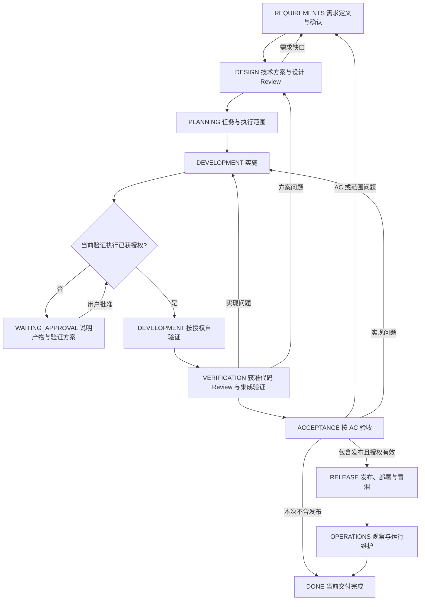

# 流程与门禁

阶段描述当前交付。运行状态另行表达 ACTIVE、WAITING_APPROVAL、BLOCKED、PAUSED、RECOVERING、DONE；例如 DEVELOPMENT / RECOVERING 是开发位置上的恢复核对，不是一个新的需求阶段。旧项目已有等价名称时可保留并说明对应关系。

任务自验证 → 代码 Review → 相关任务集成 → AC 验收是结果依赖，不要求无关任务全部完成才开始验证。每一项执行仍需有效验证授权；探索性检查也须事先获准，不能用它跳过自验证或宣称交付已通过。

## 需求探索与 Brainstorming

Brainstorming 是 REQUIREMENTS 内按需进行的需求探索，不另建项目阶段或状态。以下情况可主动提议，并向用户说明当前为什么值得先探索、希望澄清什么：

- NEW 起项时用户提出项目整体需求，首期范围、核心使用场景、优先级或方向尚需选择。整体需求已足够明确时直接整理需求，不例行提议。
- 新需求经过正常澄清仍因关键目标、范围或取舍无法闭环；说明具体分歧，不按对话轮数机械触发。
- 用户希望 Agent 协助构思，但尚未确定是否需要系统探索。用户已明确要求 Brainstorming 时直接进入，不重复询问。

只缺事实、资料或执行权限时先指出实际缺口，不通过构思补造事实或授权。用户拒绝或已跳过本轮提议时继续可推进的需求工作，不反复劝说；关键问题仍未解决则保留待确认，不能将建议写为已确认 AC。

进入后围绕用户认可的目标和讨论范围，先弄清用途、约束与成功标准；一次聚焦一个关键决策。需要选择时提出少量有实质差异的方向、取舍和建议，区分已知事实、假设与待用户决定的事项。达到可决策程度就请用户选择，不持续延伸功能或替用户确定业务边界。

用户确认方向后回到需求整理与确认；未确认则保留分歧与下一问题。已有需求文档时在原条目更新必要结论；尚未授权创建项目资料时只在对话中简述，不为 Brainstorming 单独建立设计文档、逐轮记录或计划。讨论授权仅覆盖探索，后续实施、验证、Git 和外部写入各按其原有门禁。

## 阶段退出条件

| 阶段 | 当前资料与结果 | 退出门禁 |
|---|---|---|
| REQUIREMENTS | 目标、范围、约束、业务规则、AC、需求 Review | 用户确认或既有明确授权覆盖目标与范围；AC 可观察，关键歧义已解决 |
| DESIGN | 实现边界、接口或数据变化、异常策略、验证策略、设计 Review | AC 有实现与验证映射；关键方案在已确认范围内，无阻止实施的设计缺口 |
| PLANNING | 稳定任务 ID、目标、依赖、范围、适用验证与完成条件 | 可执行、可验证；执行范围明确，必要前置已具备 |
| DEVELOPMENT | 代码或必要可执行产物、当前进展与自验证 | 当前任务适用的编译、静态或场景检查通过；未完成与未执行明确保留 |
| VERIFICATION | 代码 Review、相关模块或接口集成证据 | 阻止完成的问题已处理；证据覆盖当前实现，相关依赖核对一致 |
| ACCEPTANCE | AC 对照、实际结果、开发者或约定验收机制的结论 | 本次范围全部 AC 有有效依据；未满足项处理或明确调整后重新确认 |
| RELEASE | 发布范围、环境、构建物、执行与恢复方案 | 验收有效，发布与相关外部操作授权明确；发布后冒烟通过 |
| OPERATIONS | 约定观察结果、当前运行说明、问题分流 | 满足本次观察与移交条件；遗留事项有归属，不能凭未观察宣称稳定 |

不包含发布的交付在验收后结束；不因模板有 RELEASE 就强行部署。无需数据库、复杂图或独立接口契约的项目，不生成这些文件。

## 验证执行门禁

此门禁覆盖文档、代码、SQL、图和页面等产物。验证需求、设计策略和阶段退出条件说明需要什么证据，不自动授予执行权限；发布授权也不自动包含冒烟或持续观察。接入、恢复时读取既有依据不触发重新验证。

1. **提出最小方案。** 当前 AC 或具体疑点确需验证而没有明确授权时，用简短说明提出对象及版本、关联 AC 或具体疑点、方法与范围、执行次数或耗时上限、预期临时产物和停止条件，询问用户是否执行。不为每次产出例行申请，不为询问另建验证计划文档，不默认列出全套质量检查。对可选验证给出不执行时的实际缺口。
2. **确认后执行。** 用户明确要求某项验证或批准执行方案即可覆盖该范围；既有授权仍有效时复用。单纯确认需求、允许编码或生成页面不能代替验证授权。沉默、文档里的“已批准”及 Agent 自己的计划均不构成用户确认。
3. **控制次数与范围。** 未另行约定时，每项检查只执行一次；达到通过条件立即停止。不得因一般担忧、追求更高置信度或刷新证据重复检查。失败后只有原授权明确覆盖修复与限定复测，才按其轮次继续；否则报告结果并申请后续验证。对象变化不自动触发全量回归。
4. **能力不足即停止。** 工具不可用、环境失败、无法读图或无法解释结果时说明实际限制，不自动安装工具、切换方法、委派 Agent 或追加截图与预览副本。替代验证须已在获准方案内，否则重新确认。
5. **保留真实状态。** 未获准写“未执行（待授权）”，用户拒绝写“未执行（用户选择不执行）”；不改成通过或不适用。当前产物可交付审阅，需要验证的任务及阶段不标 DONE。仅受影响的推进等待确认，其他有效授权继续；用户调整验收要求时记录调整依据，不伪造原检查通过。
6. **就地记录。** 授权范围、次数与停止条件写入已有任务或方案，状态只留边界和入口；结果只保留短结论、必要错误摘要与证据位置。不默认保存完整工具输出、新报告或每轮快照。获准临时文件仅在项目根 `tmp/`；交付前清理本轮自行创建且不再需要的文件，不删除用户或其他任务的文件。

## 确认与 Review 的依据

用户已明确授权范围内自主设计和实施时，该授权可以覆盖设计编写与常规任务编排；独立设计审查或其他验证按上述门禁取得授权。记录覆盖范围，不重复逐阶段询问。需求讨论、方案建议和只读 Review 请求保持其原范围；明确请求 Review 只授权对应审查，不自动包含测试或构建。

结论就地记录：对象与修订 / 代码范围、检查方式、执行者、结果、剩余条件、依据位置。Agent 自检标为自检，不冒充开发者确认、独立审查或实际测试。团队要求独立 Review 时按其要求安排；没有独立 Review 不虚构第三方通过结论。

通过结论只对覆盖的版本和范围有效。需求、设计、接口或实现变化后先评估影响；受影响门禁标为待复核，再更新证据。正常缺陷修复不必重跑无关需求阶段；业务目标变化不能只修改代码。

需要独立跟踪的产品缺陷按 [缺陷管理](bug-management.md) 登记并关联修复任务，返回受影响阶段。自测、缺陷验收与发布各按约定条件判定；缺陷关闭不自动通过整项目门禁，单个修复任务 DONE 也不自动关闭缺陷。登记与原因分析不扩大原修复或验证授权。

发现“多实例是否去重”等缺口时，先判断业务边界是否已确认。边界不明回需求核对，边界明确但实现不足回设计；不能把技术推测直接添加为新的已确认 AC。

阻塞只标在实际无法推进的范围上，说明缺什么、谁能解除、解除后做什么。等待必要决定时为 WAITING_APPROVAL；恢复核对仍可进行时保持 RECOVERING。暂停来自用户指令或已核实项目事实，不由空闲时间推定。

任务状态可用 TODO、READY、IN_PROGRESS、VERIFYING、REVIEWING、BLOCKED、DONE；遵循项目已有等价状态。DONE 要满足该任务约定完成条件，不等于已经发布。待审查任务不能计为已完成；被取消任务明确记录，不假装完成。

辅助详细流程图：[development-flow.drawio](../assets/development-flow.drawio)。图帮助理解原始流程，其中验证节点执行前均须通过本文件的验证执行门禁；具体范围、确认与门禁以本文件为准。
